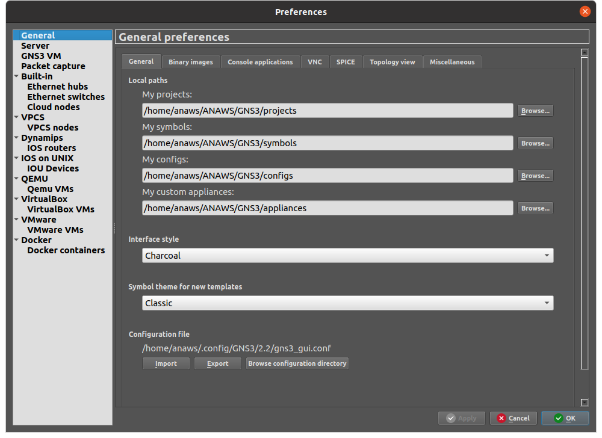
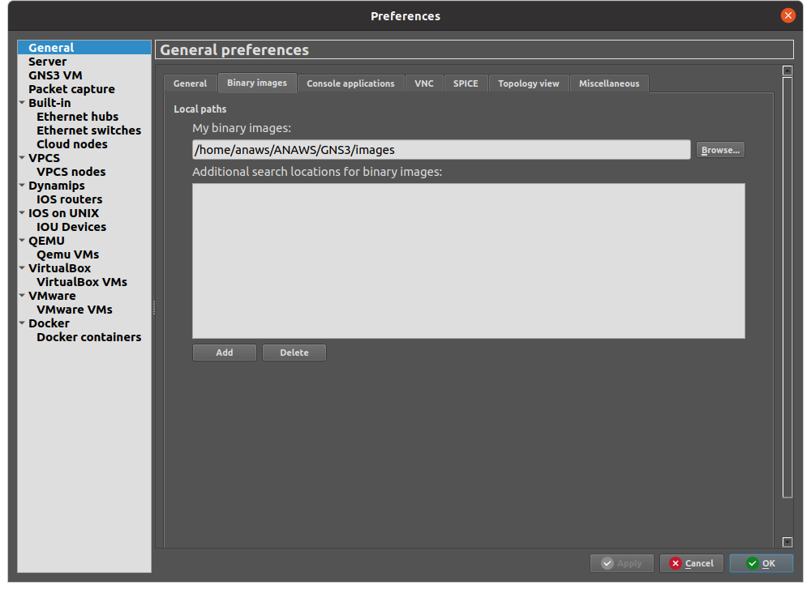

# Setup Enviroment

in this guide we will see how to setup the enviroment.

We strongly suggest to create a Virtual Machine with your favourite Linux distribution and following the next istructions.

### GNS3

in order to install GNS3 following the istructions guide made by GNS3:
- [Installation for Linux](https://docs.gns3.com/docs/getting-started/installation/linux/) (this will also install Docker)

#### After installation

Opening GNS3 and make sure that all paths under:
- Edit -> Preferences -> General (4 paths)
- Edit -> Preferences -> Binary Images (1 path) 
Will point all to the respectly folders contained in the repository under `GNS3/*`

