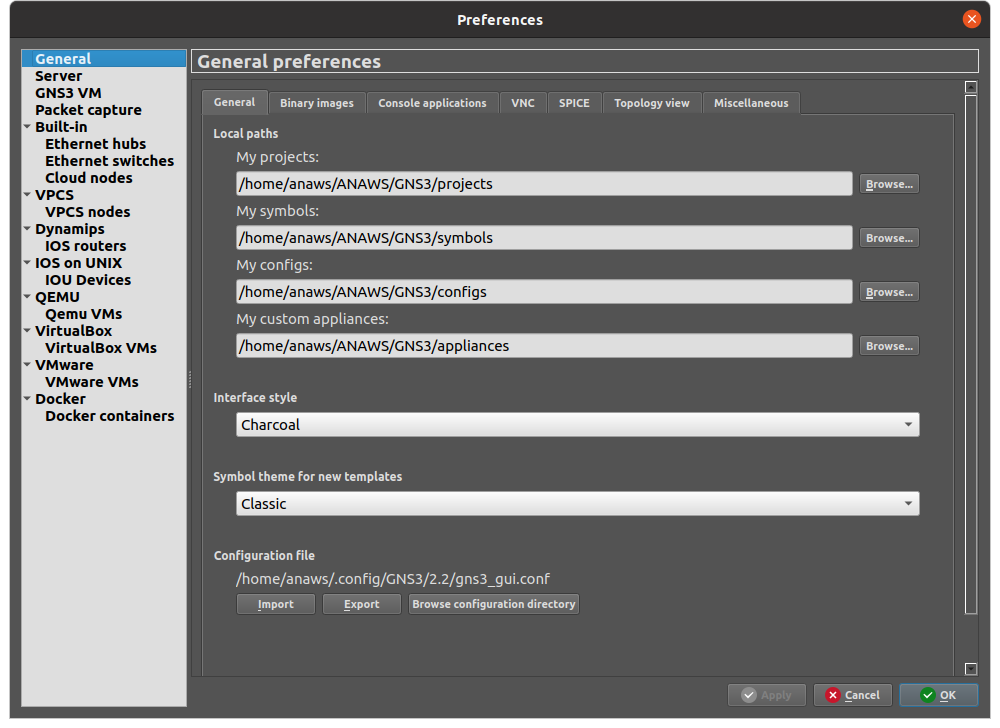
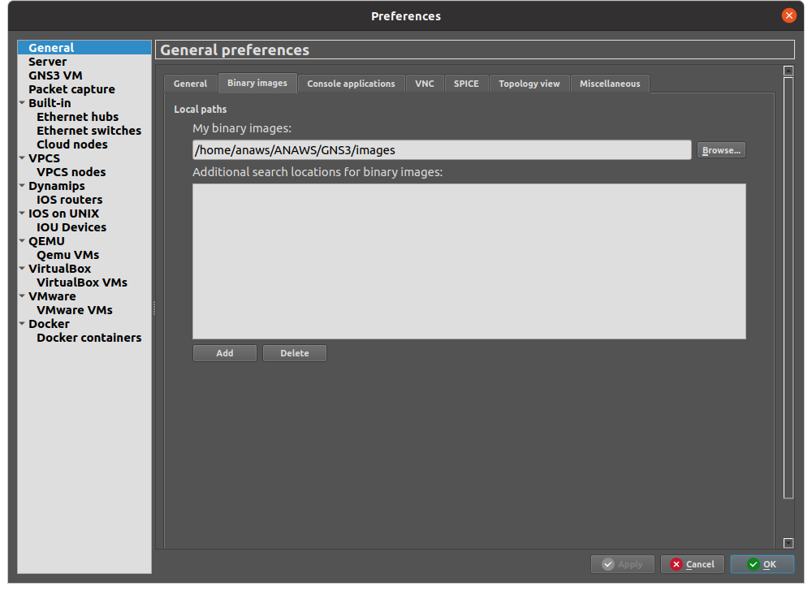

# Setup Enviroment
in this guide we will see how to setup and run the project.<br>We strongly suggest to create a Virtual Machine with your favourite Linux distribution and following the next istructions.
1) [GNS3](./setup-enviroment.md#GNS3 "GNS3") 
2) [ONOS](./setup-enviroment.md#ONOS "ONOS") 

**NOTE:** Those instructions are necessary to run the project, if you are interested in how the project is configure check [this document](./project-configuration.md)

## GNS3
in order to install GNS3 following the istructions guide made by GNS3:
- [Installation for Linux](https://docs.gns3.com/docs/getting-started/installation/linux/) (this will also install Docker)

#### After installation
Opening GNS3 and make sure that all paths under:
- Edit -> Preferences -> General (4 paths)
- Edit -> Preferences -> Binary Images (1 path)

Will point all to the respectly folders contained in the repository under `GNS3/*`

<details>
  <summary>Screenshots</summary>
  
  
  
</details>

## ONOS
Since Docker should be alredy isntalled we can start to get an ONOS image and star deploying it:

Get ONOS image
```
docker pull onosproject/onos
```
Create ONOS Docker
```
docker run -t -d -p 8181:8181 -p 8101:8101 -p 5005:5005 -p 830:830 -p 6653:6653 -p 179:2000 --name onos onosproject/onos
```
If controller alredy present just start it
```
docker start onos 
```
once it started (in order to start the container could need time, just wait :-) ) check if everithing is working 
- CLI:
  - `ssh -p 8101 -o StrictHostKeyChecking=no onos@localhost`
  - password: `rocks`
    - test apps:
      - `apps -a -s`
- GUI via browser:
    - `http://localhost:8181/onos/ui` [(link)](http://localhost:8181/onos/ui)
    - username: `onos` password: `rocks`
- REST API
    - `http://localhost:8181/onos/v1/docs128` [(link)](http://localhost:8181/onos/v1/docs128)

The last step is that we need to start 2 application in order to make use of OpenVSwitches and make them discover each other.<br>so from the ONOS CLI issue those commands
```
app activate org.onosproject.proxyarp
app activate org.onosproject.openflow
app activate org.onosproject.config
app activate org.onosproject.sdnip
```
Or from the ONOS GUI, access the application view, select the application you like to activate (`Proxy ARP/NDP` and `OpenFlow Provider Suite`), and click either the start or stop icons in the top-right corner of the screen.
### ONOS and GNS3
the presence of ONOS in the GNS3 project will be carry out with a cloud component, set up with a tap interface `host_tap`, devices can communicate to the controller throught that interface that must be configure from the host machine with those commands
```
sudo ip addr add 192.168.100.10/24 dev host_tap
sudo ip link set dev host_tap up
```
better if you add in file`/etc/network/interfaces` (for Ubuntu)
```
auto host_tap
iface host_tap inet static 
  address 192.168.100.10
  netmask 255.255.255.0
```

